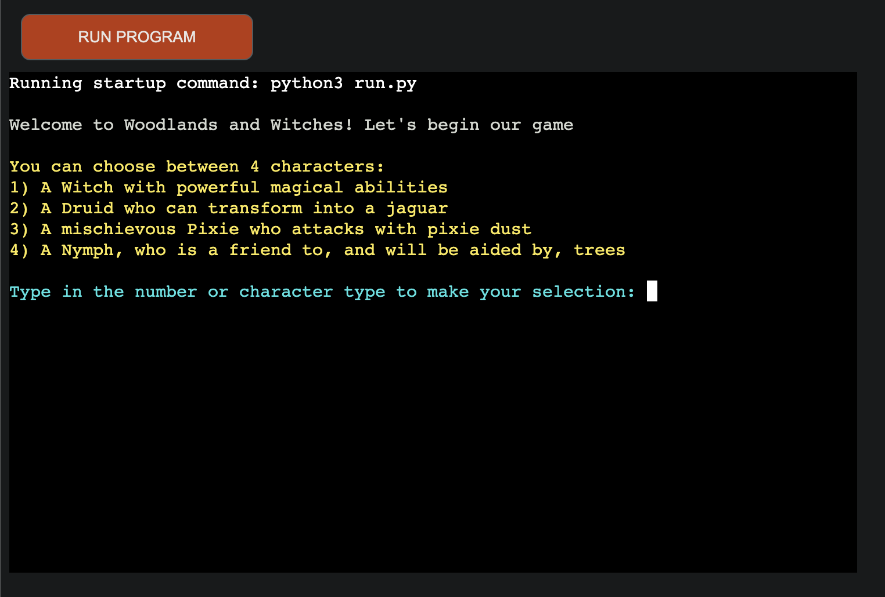
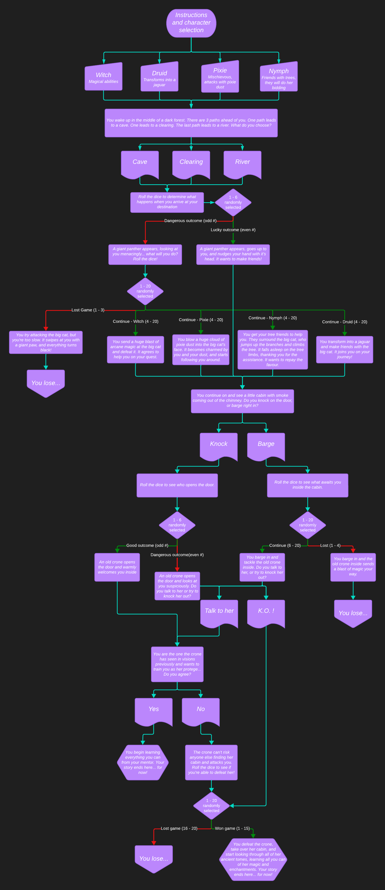

# Woodlands and Witches

Join us for a lovely Dungeons & Dragons type game called Woodlands and Witches! You will be told a story and presented with choices to make. Those choices will influence how the rest of the story goes, and whether you survive. So choose carefully!

1. [User Experience](#user-experience)
2. [Features](#features)
3. [Technologies](#technologies)
4. [Testing](#testing)
5. [Deployment](#deployment)
6. [Credits](#credits)
7. [Media](#media)

## User Experience

### Gameplay
Target audience and reasons for playing (and playing again). How long is a game, single or multiplayer.

### User Stories

- As a user, I want to be able to play a D&D-type game on my own
- As a user, I want to be able to choose a customised character for the game
- As a user, I want to have custom outcomes, based on my decisions in the game
- As a user, I want to have different types of endings, based on my decisions in the game

## Features 

- __Customised colors__ for different types of situations in the story provide clarity for the user
  - Light-grey is for story text
  - Bolded light-grey is for user selections shown in the output
  - Light-yellow is for story options for the user to choose from
  - Light-cyan is for instructions to the user
  - Bolded light-red is for a negative story outcome
  - Bolded light-green is for a positive story outcome
- __Character selection__ at the start provides interactivity for the user
- __User choices__ allow for customisation of the story, and user interactivity
- __Die rolls__ provide random outcomes, providing further story customisation
- __Character-specific outcomes__ are available, depending on story situations
- __Multiple story endings__ are available, depending on choices the user makes, and random die rolls

## Technologies

- [Lucidchart](https://www.lucidchart.com/pages) to map out the storyline and different outcomes
- [Pycharm](https://www.jetbrains.com/pycharm/) IDE linked to GitHub to edit the project files
- [GitHub](https://github.com/) to store the code and for version-control
- [GitHub Desktop](https://desktop.github.com/) to be able to commit changes to the code without having to use the web-based tool
- [Heroku](https://heroku.com/) to deploy the app and have it available for use online
- [Python](https://www.python.org/) for project functionality
  - [Termcolor](https://pypi.org/project/termcolor/) package to make different story parts clear
  - [Random](https://docs.python.org/3/library/random.html) package for random die rolls in the game
  - [Time](https://docs.python.org/3/library/time.html) package to integrate strategic pauses into the game

## Testing 
1. 

| Function | Expectation | Outcome | Comments |
|----------|:-----------:|:-------:|----------|

### Validator Testing 

#### PEP8
Minor errors were identified in the validator (tabs vs spaces and lines too long). Everything was resolved and no further errors are shown in PEP8.

## Deployment

The site was deployed via the following steps:
1. Cloned the basic repository from [Code Institute](https://github.com/Code-Institute-Org/p3-template)
   1. Code > Open with GitHub Desktop
2. Created new repository in [own GitHub](https://github.com/crazycooky77/ci_project3) for the cloned repository
3. Created new app on [Heroku](https://dashboard.heroku.com/apps)
   1. New > Create new app
   2. Provide app name and select region > Create app
4. Linked Heroku to cloned GitHub repository
   1. Click GitHub in the Deployment method section
   2. Log into GitHub, provide access to Heroku, and type in the repository name
   3. Search
   4. Connect
5. Enabled automatic deploys
   1. Tick the box for Automatic deploys in the corresponding section
6. Added python and nodejs buildpacks in the Settings > Buildpacks section

### Issues

## Credits 

### Content 

- The base template was cloned from the [Code Institute GitHub repository](https://github.com/Code-Institute-Org/p3-templ)

## Media

### Lucidchart
