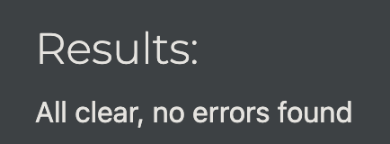

# Woodlands and Witches

Join us for a lovely Dungeons & Dragons type game called Woodlands and Witches! You will be told a story and presented with choices to make. Those choices will influence how the rest of the story goes, and whether you survive. So choose carefully!

1. [User Experience](#user-experience)
2. [Features](#features)
3. [Technologies](#technologies)
4. [Testing](#testing)
5. [Deployment](#deployment)
6. [Credits](#credits)
7. [Media](#media)

## User Experience

### Gameplay
Woodlands and Witches is a story-based game. You will be given choices and scenarios, which will allow you to progress through the story. Your decisions will have an impact on the overall possible outcomes. Though there is some luck involved as well! Certain situations will call for you to roll a die. Cross your fingers and hope for a good outcome when the time comes!

As there are various different scenarios, based on your choices, and on luck, you have the option to play again, once you finish a game, to see what other possibilities exist.

The game is currently only a single-player game. It doesn't take long - about 5 minutes to get through it. This makes it perfect to relax and pass the time, without having to commit for a longer period.

### User Stories

- As a user, I want to be able to play a D&D-type game on my own
- As a user, I want to be able to choose a customised character for the game
- As a user, I want to have custom outcomes, based on my decisions in the game
- As a user, I want to have different types of endings, based on my decisions in the game

## Features 

- __Customised colors__ for different types of situations in the story provide clarity for the user
  - Light-grey is for story text
  - Bolded light-grey is for user selections shown in the output
  - Light-yellow is for story options for the user to choose from
  - Light-cyan is for instructions to the user
  - Bolded light-red is for a negative story outcome
  - Bolded light-green is for a positive story outcome
- __Character selection__ at the start provides interactivity for the user
- __User choices__ allow for customisation of the story, and user interactivity
- __Die rolls__ provide random outcomes, providing further story customisation
- __Character-specific outcomes__ are available, depending on story situations
- __Multiple story endings__ are available, depending on choices the user makes, and random die rolls

## Technologies

- [Lucidchart](https://www.lucidchart.com/pages) to map out the storyline and different outcomes
- [Pycharm](https://www.jetbrains.com/pycharm/) IDE linked to GitHub to edit the project files
- [GitHub](https://github.com/) to store the code and for version-control
- [GitHub Desktop](https://desktop.github.com/) to be able to commit changes to the code without having to use the web-based tool
- [Heroku](https://heroku.com/) to deploy the app and have it available for use online
- [Python](https://www.python.org/) for project functionality
  - [Termcolor](https://pypi.org/project/termcolor/) package to make different story parts clear (added to requirements.txt)
  - [Random](https://docs.python.org/3/library/random.html) package for random die rolls in the game
  - [Time](https://docs.python.org/3/library/time.html) package to integrate strategic pauses into the game

## Testing

| Function                                      |                                                                     Expectation                                                                      | Pass     |
|-----------------------------------------------|:----------------------------------------------------------------------------------------------------------------------------------------------------:|:---------|
| Game start                                    |                                          Welcome message and character selection with input field for user                                           | &check;  |
| Colour-coded game text                        |                               Game text is colour-coded, according to the type of text (see Features for more details)                               | &check;  |
| Number input for user selection               |                      When the user enters a number to select an option, the game should accept the correct corresponding option                      | &check;  |
| Word input for user selection                 |              When the user enters a word to select an option, the game should accept the correct matching option, regardless of casing               | &check;  |
| Incorrect input for user selection            |  When the user enters an invalid number/word to select an option, the game should provide an error message and request another input from the user   | &check;  |
| Confirmation messages for correct user inputs |               When the user provides a correct input to select an option, the game should show a message, confirming the user's input                | &check;  |
| Pauses between game scenarios                 |           The game should have adequate pauses between selections and scenarios in the game, so as to not rush the user through the story            | &check;  |
| Die rolls                                     |                               Any input, including no input, starts the die roll function, when requested by the game                                | &check;  |
| Confirmation of number rolled for die rolls   |                   Whenever the user rolls the die, the game should provide a message to let the user know what number they rolled                    | &check;  |
| Character-specific scenarios                  | For game scenarios, where there are different outcomes, depending on the character the user selected, the game provides the correct, custom, outcome | &check;  |
| Game ending                                   |                                      When a game ends, a message should appear, offering the user to play again                                      | &check;  |
| Restart game                                  |                    When the game asks the user if they want to play again, and the user selects Y/y, the game should start again                     | &check;  |
| Finish playing                                |       When the game asks the user if they want to play again, and the user selects N/n, the game should provide a message and quit the program       | &check;  |
| All scenario flows according to Lucidchart    |                 The game provides options, requests inputs, and determines outcomes, based on the initial outline in the Lucidchart                  | &check;  |

### Validator Testing 

#### PEP8
Minor errors were identified in the validator (tabs vs spaces and lines too long). Everything was resolved and no further errors are shown in PEP8.

## Deployment

The site was deployed via the following steps:
1. Cloned the basic repository from [Code Institute](https://github.com/Code-Institute-Org/p3-template)
   1. Code > Open with GitHub Desktop
2. Created new repository in [own GitHub](https://github.com/crazycooky77/ci_project3) for the cloned repository
3. Created new app on [Heroku](https://dashboard.heroku.com/apps)
   1. New > Create new app
   2. Provide app name and select region > Create app
4. Linked Heroku to cloned GitHub repository
   1. Click GitHub in the Deployment method section
   2. Log into GitHub, provide access to Heroku, and type in the repository name
   3. Search
   4. Connect
5. Enabled automatic deploys
   1. Tick the box for Automatic deploys in the corresponding section
6. Added python and nodejs buildpacks in the Settings > Buildpacks section

## Credits 

### Content 

- The base template was cloned from the [Code Institute GitHub repository](https://github.com/Code-Institute-Org/p3-templ)

## Media

### Lucidchart
